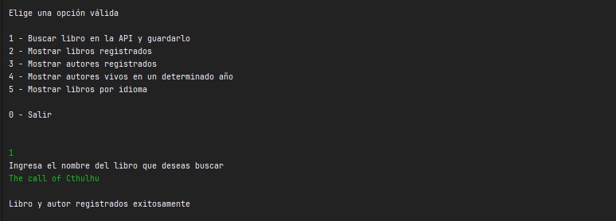
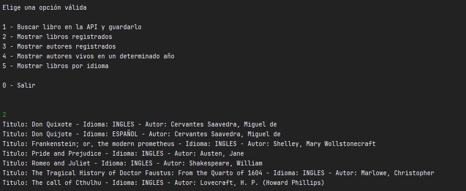
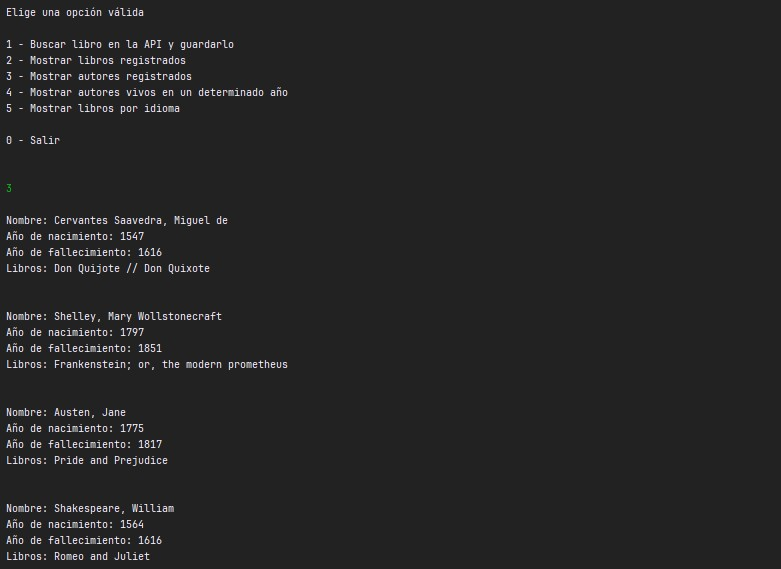
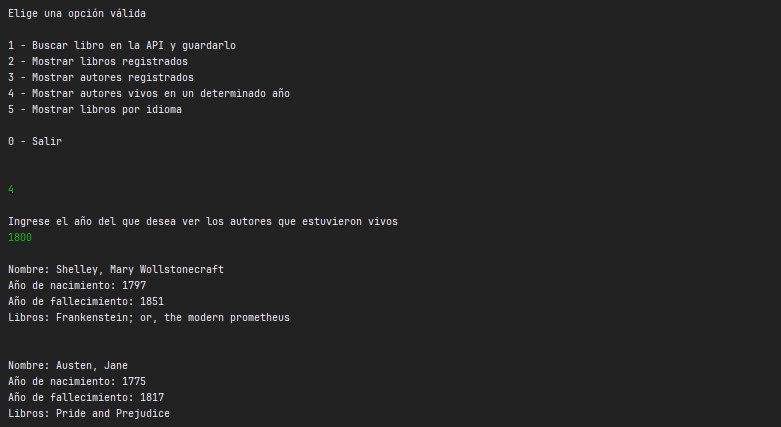
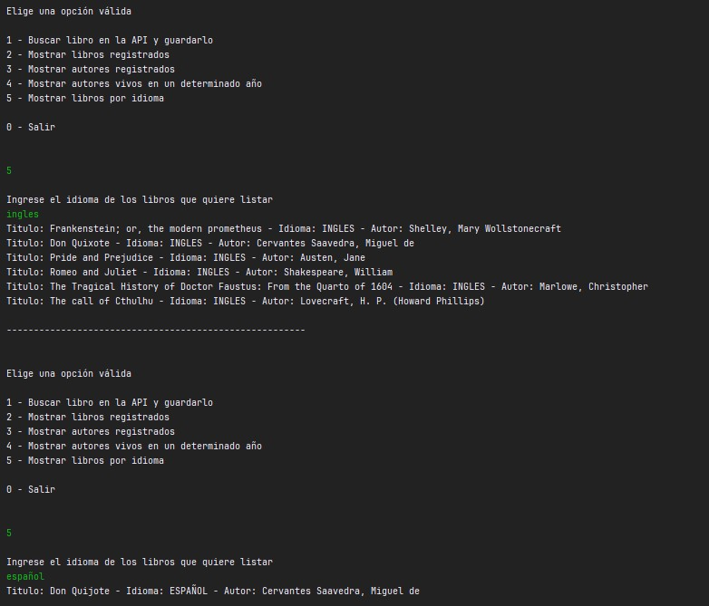

<div>
       
</div>

# Literalura Challenge

:nut_and_bolt: Proyecto en construcción :nut_and_bolt:

1. [Descripción](#descripción)
2. [Tecnologías Utilizadas](#tecnologías-utilizadas)
3. [Estructura del proyecto](#estructura-del-proyecto)
4. [API utilizada](#api-utlizada)
5. [Funcionalidades](#funcionalidades)
6. [Modelo de datos](#modelo-de-datos-)  
     6.1[Relación](#relacón)
7. [Conceptos Aplicados](#conceptos-aplicados)
8. [Cómo ejecutar el proyecto](#cómo-ejecutar-el-proyecto)
9. [Ejemplos de uso y resultados](#ejemplos-de-uso-y-resultados)
10. [Mejoras futuras](#mejoras-futuras)
8. [Desarrolladores](#desarrolladores)

## Descripción

Aplicación de consola desarrollada en Java con Spring Boot y JPA que permite consultar libros desde la API de Gutendex y almacenarlos en una base de datos relacional.

El sistema permite guardar libros y autores evitando duplicados, así como realizar distintas consultas sobre la información almacenada.

## Tecnologías Utilizadas
* Java 17+
* Spring Boot
* Spring Data JPA
* Hibernate
* PostgreSQL / MySQL (según tu configuración)
* Maven
* API Gutendex
* Streams y Optional (Java)
* JPQL

## Estructura del proyecto
```
src/
└── main/
    ├── java/com.aluracursos.literatura_challenge/
    │   ├── model/        -> Contiene las entidades, records y enum del sistema
    │   ├── principal/    -> Maneja el menú e interacción con el usuario
    │   ├── repository/   -> Interfaces JPA para acceso a datos
    │   ├── service/      -> Consumo de API y conversión de datos
    │   └── LiteraturaChallengeApplication.java -> Punto de entrada de la aplicación
    │
    └── resources/
        ├── application.properties -> Configuración del proyecto
        └── imágenes/              -> Capturas de funcionamiento para el README
        

literatura-challenge/
├── src/
│   ├── main/
│   │   ├── java/com.aluracursos.literatura_challenge/
│   │   │   ├── model/
│   │   │   │   ├── Autor.java
│   │   │   │   ├── Auxiliar.java
│   │   │   │   ├── DatosAutor.java
│   │   │   │   ├── DatosLibro.java
│   │   │   │   ├── Idiomas.java
│   │   │   │   └── Libro.java
│   │   │   ├── principal/
│   │   │   │   ├── Principal.java
│   │   │   │   └── PrincipalNuevo.java
│   │   │   ├── repository/
│   │   │   │   ├── AutorRepository.java
│   │   │   │   └── LibroRepository.java
│   │   │   ├── service/
│   │   │   │   ├── ConsumoAPI.java
│   │   │   │   ├── ConvierteDatos.java
│   │   │   │   └── IConvierteDatos.java
│   │   │   └── LiteraturaChallengeApplication.java
│   │   └── resources/
│   │       ├── application.properties
│   │       └── imágenes de apoyo para el README
├── pom.xml
├── README.md
└── archivos auxiliares de Maven
```

## API utlizada
Gutendex https://gutendex.com/

Esta API proporciona información sobre libros del proyecto Gutenberg, incluyendo:
* título
* autor
* idioma
* número de descargas

## Funcionalidades
La aplicación permite:
* Buscar libros por títulos: consulta la API Gutendex y guarda el libro en la base de datos si no existe.
  * Si el autor ya existe, no se duplica.
  * Si el libro ya existe, se evita guardarlo nuevamente.
* Listar libros registrados: Muestra todos los libros almacenados en la base de datos junto con su autor.
* Listar autores registrados: Muestra los autores almacenados junto con los títulos de sus libros registrados. 
* Mostrar autores vivos en un determinado año: Permite consultar qué autores estaban vivos en un año específico. La consulta considera que: 
<div style="text-align: center;">

```
anioNacimiento <= año consultado
y
anioFallecimiento >= año consultado o es NULL
```
</div>

* Listar libros por idioma: Permite listar los libros almacenados y filtrados por iioma. Los idiomas disponibles son:
  * Español
  * Inglés

## Modelo de datos: 
### Autor

|     Atributo      |    Tipo     |
|:-----------------:|:-----------:|
|        id         |    Long     |
|      nombre       |   String    |
|  anioNacimiento   |   Integer   |
| anioFallecimiento |   Integer   |
|      libros       | List<Libro> |


### Libro
|    Atributo     |  Tipo  |
|:---------------:|:------:|
|       id        |  Long  |
|     titulo      | String |
|     idioma      |  Enum  |
| numeroDescargas | Double |
|      autor      | Autor  |

#### Relacón

<div style="text-align: center;">

```
Autor(1) ----- (N)Libro
```
</div>

## Conceptos aplicados
Este proyecto implementa
* Consumo de APIs REST
* Conversión de JSON a objetos Java
* Uso de records
* Persistencia con Spring Data JPA
* Relaciones OneToMany / ManyToOne
* Consultas JPQL
* Manejo de Lazy Loading
* Uso de JOIN FETCH
* Uso de Streams en Java

## Cómo ejecutar el proyecto
1. Clonar el repositorio   
```
git clone https://github.com/tuusuario/literatura-challenge.git
```
2. Entrar al proyecto
```
cd literatura-challenge
```
2. Crear la base de datos: para este proyecto se utilizó PostgreSQL junto con pgAdmin.
```
CREATE DATABASE alura_literalura
```
3. Configuración de la base de datos en ```aplication.properties```
```
spring.application.name=literatura-challenge
spring.datasource.url=jdbc:postgresql://${DB_HOST}/alura_literalura
spring.datasource.username=${DB_USER}
spring.datasource.password=${DB_PASSWORD}
spring.datasource.driver-class-name=org.postgresql.Driver
hibernate.dialect=org.hibernate.dialect.HSQLDialect
spring.jpa.hibernate.ddl-auto=update
```
4. Ejecutar la aplicación

## Ejemplos de uso y resultados
1. Opción no. 1: buscar libros en la API y guardarlos en la base de datos.
  * Si el libro no existe en la base de datos pero el autor si, solo se guarda el libro sin duplicar su autor.


2. Opción no. 2: se muestran todos los libros guardados en la base de datos junto con su autor


3. Opción no. 3: muestra todos los autores guardados en la base de datos


4. Opción no. 4: muestra todos los autores que estuvieron vivos en un determinado año


5. Opción no. 5: muestra todos los libros que están en un determinado idioma



## Mejoras futuras
* Interfaz gráfica
* Paginación de resultados
* Búsquedas avanzadas
* API REST propia
* Dockerización del proyecto

## Desarrolladores
* Mariana Rodríguez
    * [Linkedin](https://www.linkedin.com/in/mariana-rodr%C3%ADguez-b19b0048/)
    * [GitHub](https://github.com/marirois)